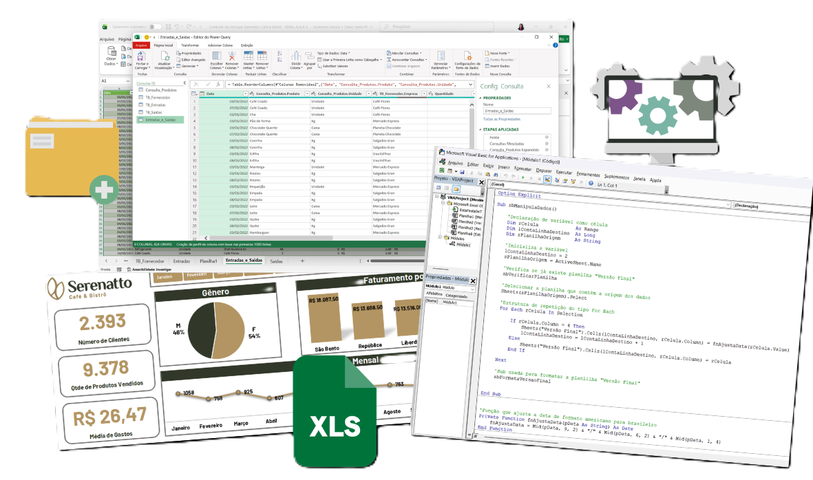

# 📊 Projetos em Excel

Este repositório reúne diversos projetos desenvolvidos em **Microsoft Excel**, utilizando recursos avançados como:

- **Power Pivot**
- **Gráficos e Dashboards**
- **Planilhas automatizadas**
- **Macros em VBA**

Os arquivos aqui têm o objetivo de demonstrar aplicações práticas para análise de dados, automação de tarefas e visualização interativa, sendo úteis tanto para estudos quanto para aplicações no dia a dia profissional.

> 📚 **Estes projetos estão sendo desenvolvidos como parte dos cursos da plataforma [Alura](https://www.alura.com.br/).**

---

## 🧰 Recursos Utilizados

- Power Pivot para modelagem de dados
- Power Query
- Visual Basic for Applications (VBA)
- Tabelas e Gráficos Dinâmicos
- Fórmulas e funções avançadas

